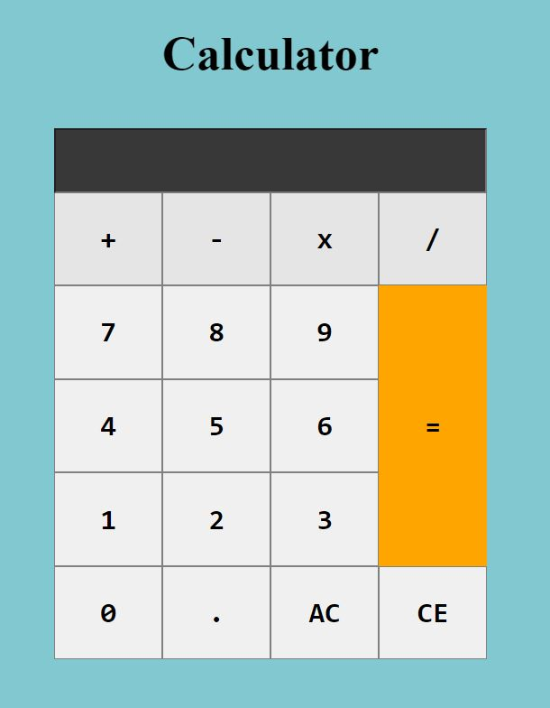

# ⭐ Project - Calculator ⭐

This was the first project of javascript where i used pure HTML,CSS and Javascript to build this calculator.

I got this assignment from iNeuron Bootcamp.

 

📌 Learnings:

👉 1\. Revision of HTML and CSS. 
👉 2\. DOM Manipulation 
👉 3\. Event listeners and Handlers 
👉 4\. Learned about onclick event, eval method, foreach loop and slice method. 

 

> Time taken to build this project is 1hr.

  

## Links

[Live](jscalculator.netlify.app)

[Linkedin](https://www.linkedin.com/in/pratyush-kesarwani-2b6601171/)

### Acknowledgements:

I am thankful to Hitesh Choudhary sir, Anurag sir and iNeuron team for this amazing bootcamp.
